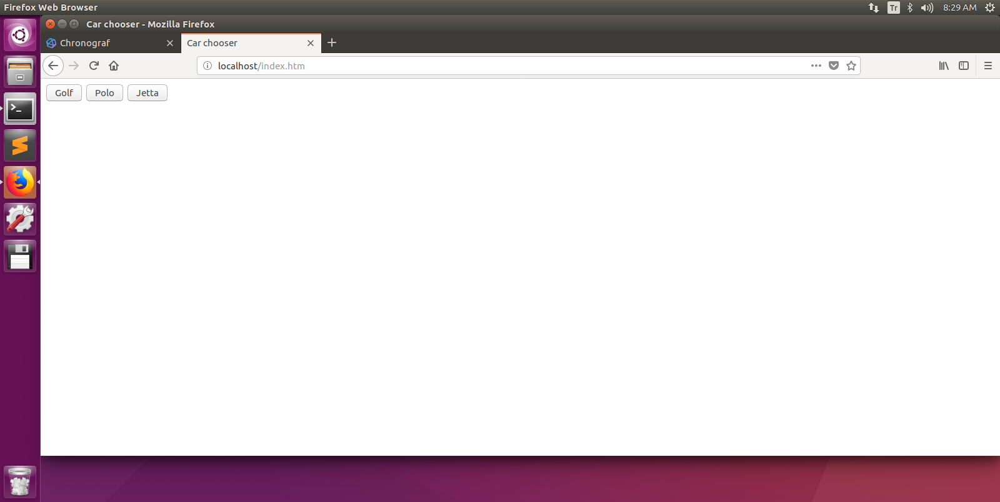
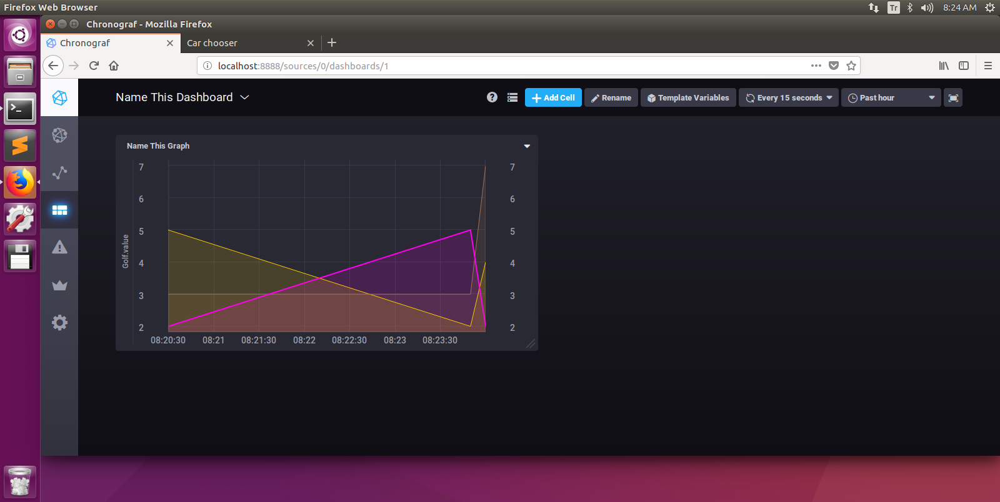

# Kollekto

A Simple, Initial, Unsecure, Fresh-born analytics collection app, aiming to inspire dev people about creating new software bundles for analytics works. 

As usual, We need a DB, a backend for serving, a fronend for consuming. All will be containerized with Docker-ce.

I choose InfluxDB for saving data; it is a special timeseries DB with great performance on listings. Also InfluxData team bounded Telegraf for transmitting data, Kapacitor for alerting, Chronograf for admin, data monitoring and graphing tool like Graphana in a stack.

How will DB and backend will communicate? Answer is Statsd plugin of Telegraf. We are sending commands like "nc xx to this network" with Lynx plugin from NPM and use it to send metrics values to Statsd server living via a plugin inside Telegraf.

In server-side part, I am giving vote to HapiJS for shortening development time; it is easy to add a new route in seconds. Built in WalmartLabs to fix performance problems in days of going crazy of market.

Using a simple frontend page to make ajax-get calls to Hapi backend.

Full code detail at http://oguzhanceylan.com/2018/03/17/kollekto-an-initial-containerized-clickstream-app-with-hapijs-nodejs-influxdb-and-chronograf/

## Getting Started

### Prerequisites

1-  Linux distro (tried on Ubuntu 16.04 LTS)

2-  A ready, helloWorld running Docker installation. If you are about to setup Docker-CE, you can refer to http://oguzhanceylan.com/2018/03/03/docker-ce-installation-on-fresh-ubuntu-16-04/

3- Docker-compose. If you are about to install Docker-compose please refer to https://docs.docker.com/compose/install/

3- Chmod -R 777 (a general precaution for not struggling with permissions)

4- Git

### Installing

Download code with below command on your working directory:

```
sudo git clone https://github.com/oceylantr/Kollekto.git
```

Give all permission for passing security phase now:

```
sudo chmod -R 777 Kollekto
```

Get in the code 

```
cd Kollekto
```

Firstly, we have code at backend part waiting for build

```
sudo docker-compose --file docker-compose.yml build --no-cache
```

This command works only build-waiting images, passes other tagged download-ready images. Now we are ready to compose; it will pass already build backend image, download InfluxData stack (InfluxDB, Chronograf, Kapacitor, Telegraf), a simple Web server taka0225/alpine-http-server to run an index.htm to call Rest apis lying on NodeJS-HapiJS backend. 

```
sudo docker-compose up -d
```

## Verifiying installation

We can see container status with 

```
sudo docker ps
```

We should see 8 containers running: Influxdb, Telegraf, Chronograf, Kapacitor, Influx CLI, Kapacitor CLI

### Check frontend

Check localhost/index.htm in browser on your host OS

### Check backend

Check localhost:8066 in browser on your host OS. If it is saying like "Selam dokka", HapiJS backend is serving main entrypoint of Rest part successfully

### Check Chronograf

Check localhost:8888 in browser on your host OS. It should be coming, Chronograf's black, kool page

## Configuring Showcase

Open localhost/index.htm and make 3 sets of moves:



In each set you will click Golf, Polo and Jetta buttons few times and wait for a 10-15 seconds until new set. We are making this for Telegraf to transfer clickstream values in periods, that peroiding is one of main features of timeseries db's

Now everything is ready to make good-lookin graphs on Chronograf. Please open localhost:8888 and go to Dashboards link at left. Create a dashboard and add a Graph. Below Cell Editor, with Plus button make 3 queries and fill them with below sequentially

```
SELECT "value" FROM "telegraf"."autogen"."Golf" WHERE time > :dashboardTime:
SELECT "value" FROM "telegraf"."autogen"."Polo" WHERE time > :dashboardTime:
SELECT "value" FROM "telegraf"."autogen"."Jetta" WHERE time > :dashboardTime:
```



## Built With

* [InfluxData Tick Stack](https://www.influxdata.com/time-series-platform/) - No:1 Timeseries db and Util pack
* [HapiJS](https://hapijs.com/) - A NodeJS stack build in WalmartLabs with great plugin architecture
* [Docker](https://www.docker.com/) - You know what it is I think

## Authors

* **Oğuzhan Ceylan** - *Initial work* - [oceylantr](https://github.com/oceylantr)

## License

This project is licensed under the GPL v3.0 - see the [LICENSE](LICENSE) file for details

## Acknowledgments

* InfluxDB - Tick Stack (Thanks to https://github.com/influxdata/TICK-docker/blob/master/README.md)
* HapiJS Rest Backend (Thanks to Joseph Jude when containerizing Hapi-Node backend https://jjude.com/hapijs-on-docker/)
* Frontend Webserver Docker image (Thanks to https://hub.docker.com/r/taka0225/alpine-http-server/)
